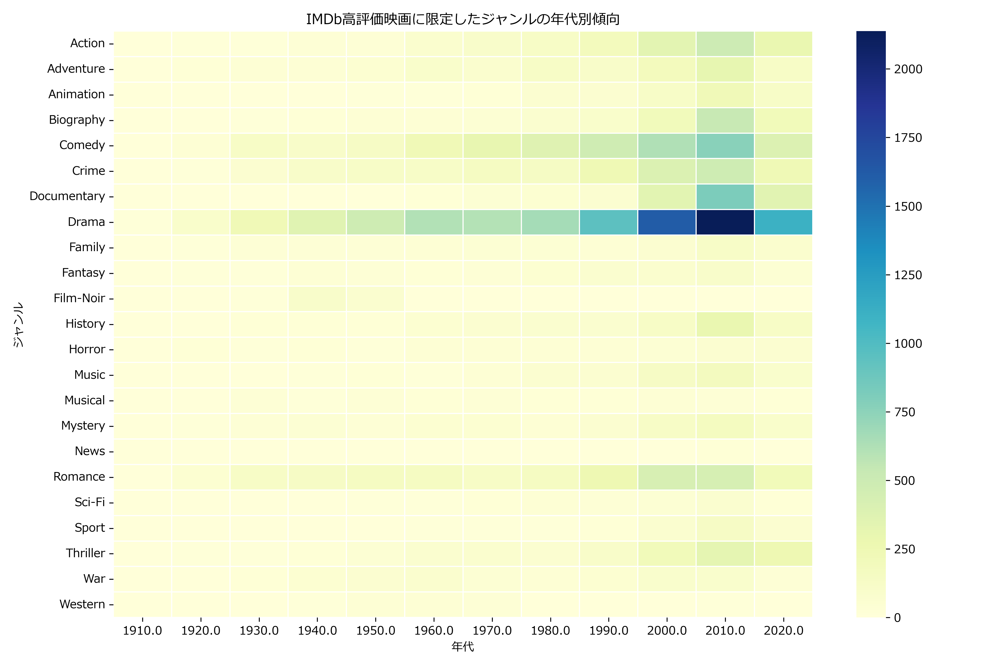

# IMDbジャンルトレンド分析

このプロジェクトでは、IMDbの映画データを用いて、
- ジャンルごとの年代別トレンド
- 高評価映画に限定した傾向
- 日本公開作品や単一ジャンルに絞った分析

を行い、グラフとして可視化しています。

## 可視化例

## データ出典

IMDb公式データセット: https://datasets.imdbws.com/

> ※ ファイルサイズが大きいため、GitHubには含まれていません。`data/` フォルダに配置してから実行してください。

## 使用技術

- Python (pandas, matplotlib, seaborn)
- Jupyter Notebook